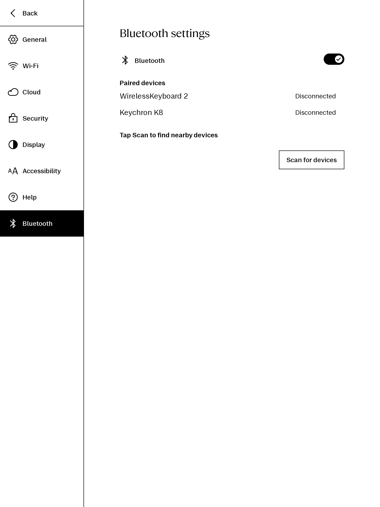

# reMarkable Bluetooth Settings

Adds a Bluetooth settings page to xochitl, allowing pairing and management of Bluetooth keyboards directly from the reMarkable UI.

## Installation

Installation via the [Vellum package manager](https://github.com/vellum-dev/vellum) is recommended. Dependencies are handled automatically.

### Manual

Requires [xovi](https://github.com/asivery/rmpp-xovi-extensions), qt-resource-rebuilder, and qt-command-executor.

Download `bluetoothSettings.qmd` from the [latest release](https://github.com/rmitchellscott/xovi-bluetoothsettings/releases/latest).

Copy to `/home/root/xovi/exthome/qt-resource-rebuilder/` and restart xovi.

The `icons/bluetooth.rcc` file must also be placed alongside the QMD.
